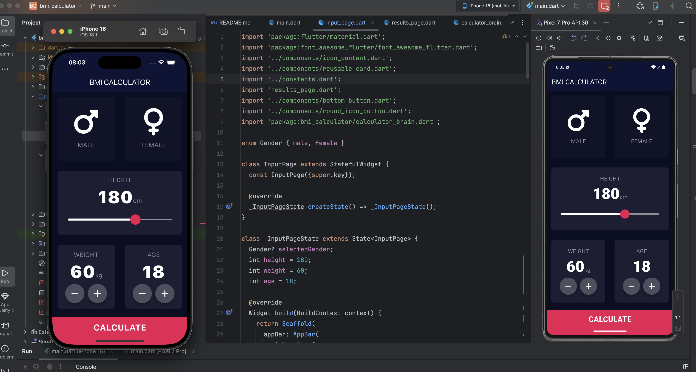
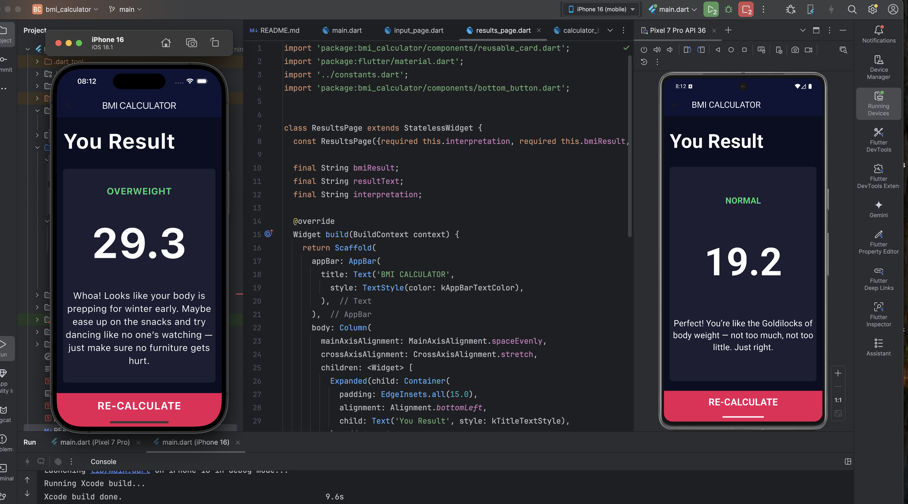

# 💪 BMI Calculator App

A beautiful and responsive BMI (Body Mass Index) Calculator app built with **Flutter**. This project is a great practice for UI design, layout management, and interactive elements using Flutter widgets.

---

## 🚀 Features

- 🔢 Input height (cm) and weight (kg)
- 🧮 Real-time BMI calculation using `CalculatorBrain` logic
- 📊 Categorizes BMI result as "Normal", "Overweight", "Underweight", etc.
- 🎨 Clean, animated UI design with sliders and custom buttons
- 📱 Responsive layout across Android and iOS devices

---

## 📦 Tech Stack

- [Flutter](https://flutter.dev/)
- Dart language
- FontAwesome icons
- Custom widgets:
    - `ReusableCard`
    - `RoundIconButton`
    - `BottomButton`

---

## Screenshots

---

Built as part of my Flutter learning journey.