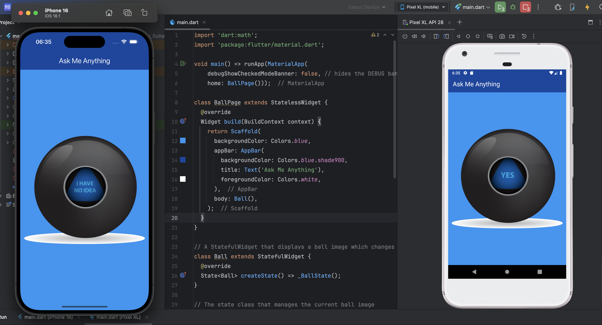

# Magic Ball - Flutter App

This is a simple Flutter app that simulates an “Ask Me Anything” magic ball.  
When you tap the ball image, it randomly changes to show one of five possible answers.

## Features

- Simple and clean blue-themed UI
- Tap the ball to get a random response (image changes randomly)
- Uses a `StatefulWidget` to update UI on tap
- Removes the debug banner for a cleaner look

## How It Works

- The `Ball` widget holds the current ball number state.
- Each tap triggers a new random number between 1 and 5.
- The displayed image changes based on the current ball number.
- Images are stored in `images/ball1.png` to `images/ball5.png`.

## Getting Started

1. Ensure you have Flutter installed.
2. Add ball images (`ball1.png` to `ball5.png`) in the `images` folder.
3. Run the app on your emulator or physical device.
4. Tap the ball image to see it change randomly!

## Screenshots

---

Built as part of my Flutter learning journey.
