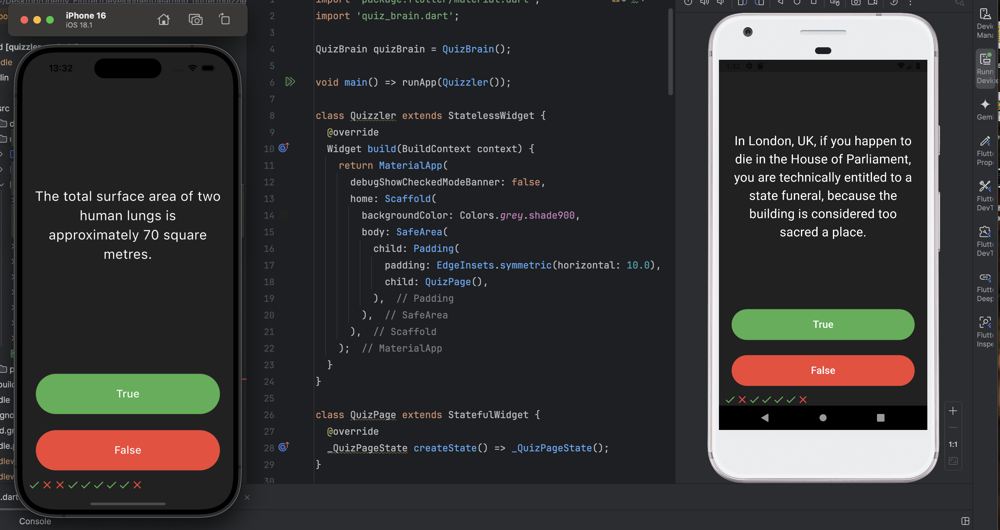

# 🧠 Quizzler App

A simple true-or-false quiz app built with **Flutter** for Udemy course challenge.

---

## 📱 Features

- ✅ True/False trivia questions
- 🎯 Score tracking
- 🚀 Restart the quiz at any time
- 🎨 Clean and minimal UI
- 📊 Final score displayed when quiz ends

---

## Screenshot

