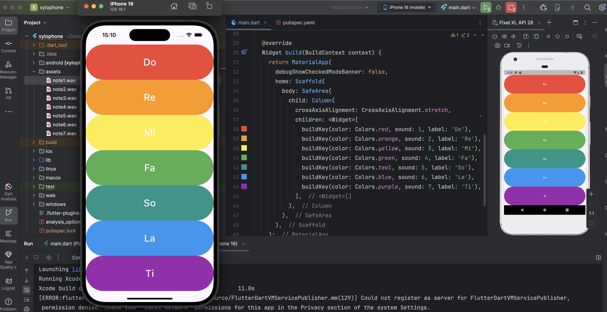

# Flutter Xylophone App

This is a beginner Flutter project from the **Udemy course "The Complete Flutter Development Bootcamp" by Angela Yu**. 
The app displays a vertical layout of colorful buttons, each playing a musical note (Do to Ti) when tapped, mimicking a xylophone.

## Screenshot

